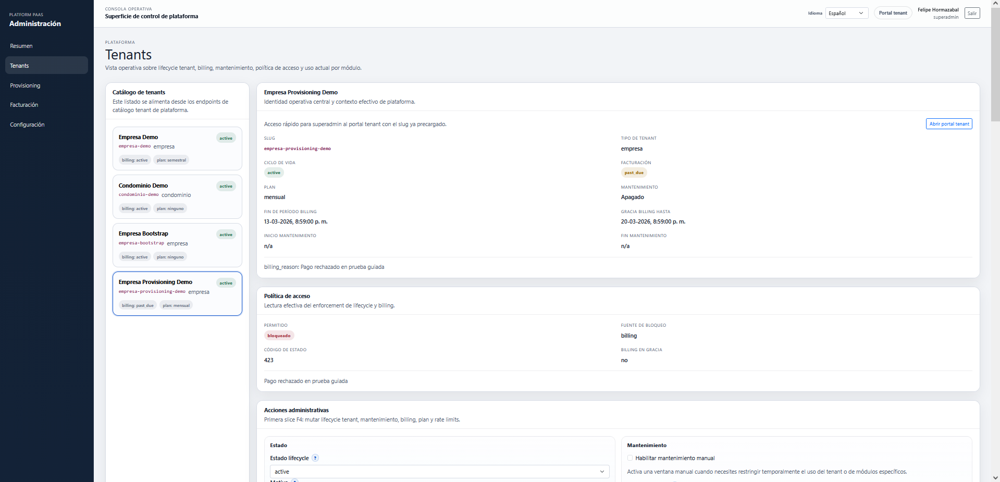
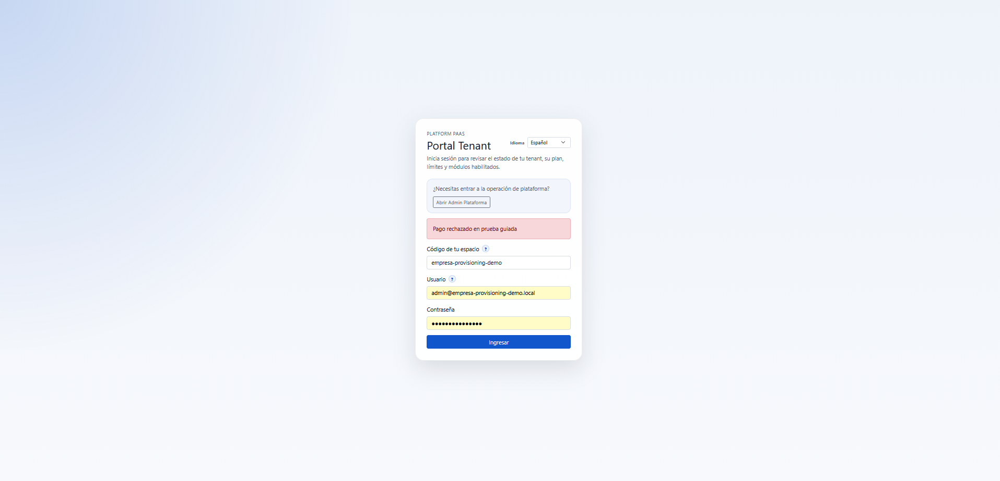

# Prueba Guiada de Billing

Este runbook documenta la prueba real usada para entender `Billing` de punta a punta sobre un tenant ya provisionado.

La idea es simple:

- crear un evento de billing controlado
- ver como cambia el tenant en `Tenants`
- leer el evento en `Billing`
- desalinear manualmente el estado del tenant
- usar `Reconciliar`
- confirmar el flujo `applied -> reconciled`

## Objetivo

Entender en la practica que significa `Billing` en esta plataforma.

Hoy `Billing` no es un motor completo de cobro.

Es una consola operativa para trabajar sobre eventos de sync billing ya persistidos en `platform_control`.

Sirve para:

- resumir eventos por proveedor y tipo
- leer el workspace de un tenant
- revisar alertas
- reimponer el estado de un tenant usando `Reconciliar`
- decidir rapido si lo urgente es mirar alertas activas, un reconcile puntual o una desalineacion manual del tenant

## Cuándo usar esta prueba

Usa esta guia cuando necesites:

- explicar `Billing` a alguien nuevo
- validar que un evento sync cambia correctamente el estado del tenant
- demostrar la diferencia entre `applied` y `reconciled`
- entender por que un tenant queda `past_due` pero sigue en gracia

## Precondiciones

- backend levantado
- frontend levantado
- acceso como `superadmin` a `platform_admin`
- tenant sano y operativo para la prueba

## Caso controlado usado

Tenant usado:

- nombre: `Empresa Provisioning Demo`
- slug: `empresa-provisioning-demo`

Estado inicial esperado:

- `lifecycle = active`
- tenant ya provisionado
- acceso permitido

## Qué significan los conceptos clave

### Evento de billing

Es un hecho externo persistido por plataforma.

Ejemplo de esta prueba:

- proveedor: `stripe`
- tipo de evento: `invoice.payment_failed`

### `applied`

Significa:

- el evento se guardo
- el backend lo aplico sobre el tenant
- el estado del tenant cambio segun ese evento

### `reconciled`

Significa:

- el evento ya existia
- el tenant fue desalineado o necesitas reimponer su estado
- `Billing` volvio a aplicar ese evento persistido

## Paso 1. Crear un evento de billing controlado

Comando usado:

```bash
cd /home/felipe/platform_paas/backend
PYTHONPATH=/home/felipe/platform_paas/backend \
/home/felipe/platform_paas/platform_paas_venv/bin/python - <<'PY'
from datetime import datetime, timezone

from app.common.db.control_database import ControlSessionLocal
from app.apps.platform_control.repositories.tenant_repository import TenantRepository
from app.apps.platform_control.services.tenant_billing_sync_service import TenantBillingSyncService

db = ControlSessionLocal()
try:
    tenant = TenantRepository().get_by_slug(db, "empresa-provisioning-demo")
    if not tenant:
        raise SystemExit("Tenant empresa-provisioning-demo no encontrado")

    result = TenantBillingSyncService().apply_sync_event(
        db=db,
        tenant_id=tenant.id,
        provider="stripe",
        provider_event_id="evt_demo_empresa_provisioning_001",
        event_type="invoice.payment_failed",
        billing_status="past_due",
        billing_status_reason="Pago rechazado en prueba guiada",
        billing_current_period_ends_at=datetime(2026, 3, 22, 23, 59, tzinfo=timezone.utc),
        billing_grace_until=datetime(2026, 3, 29, 23, 59, tzinfo=timezone.utc),
        provider_customer_id="cus_demo_empresa_provisioning",
        provider_subscription_id="sub_demo_empresa_provisioning",
        raw_payload={"source": "guided-billing-test"},
        actor_context={"sub": "manual-guided-test", "email": "admin@platform.local"},
    )

    print("tenant_slug:", result.tenant.slug)
    print("billing_status:", result.tenant.billing_status)
    print("billing_status_reason:", result.tenant.billing_status_reason)
    print("was_duplicate:", result.was_duplicate)
    print("processing_result:", result.sync_event.processing_result)
    print("event_id:", result.sync_event.id)
finally:
    db.close()
PY
```

Resultado esperado:

- el tenant pasa a `billing_status = past_due`
- queda fecha de gracia futura
- el evento queda persistido con `processing_result = applied`

## Paso 2. Ver el efecto en `Tenants`

Despues de aplicar el evento, `Tenants` debe mostrar que el tenant sigue operativo, pero bajo presion de billing:

- `Facturación = past_due`
- `Billing en gracia = si`
- `billing_reason = Pago rechazado en prueba guiada`
- fechas de `Fin de periodo billing` y `Gracia billing hasta`
- identidad de billing poblada con `stripe`, `customer_id` y `subscription_id`

Esta es la lectura correcta:

- el tenant no esta suspendido aun
- el tenant entro a deuda
- como sigue dentro de gracia, la politica de acceso aun lo deja operar


Nota:

- la captura ya muestra el estado real del tenant en `Tenants`
- ahi se ven `past_due`, razon, fechas y gracia aplicadas por el evento

## Paso 3. Leer la pantalla `Billing`

### Resumen y filtros


### Workspace y alertas


### Eventos tenant y reconcile


### Workspace reconciliado


Despues del evento, la pantalla debe mostrar:

- proveedor `stripe`
- tipo de evento `invoice.payment_failed`
- resultado `applied`
- tenant workspace apuntando a `empresa-provisioning-demo`
- evento visible en la tabla inferior

Lectura correcta:

- `Resumen global de facturación` dice que existe un evento de ese tipo y proveedor
- `Resumen billing tenant` resume el stream del tenant seleccionado
- `Eventos billing tenant` muestra la fila concreta que podra reconciliarse despues
- `Qué revisar ahora` da una lectura corta para separar alertas vivas de un historial ya estabilizado
- `Reconciliar` y `Reconciliar lote` ya pasan por confirmacion previa para evitar reimponer estados por error

## Paso 4. Desalinear manualmente el tenant

Para que la prueba de `Reconciliar` tenga sentido, primero se cambia manualmente el billing del tenant desde `Tenants`.

Mutacion hecha:

- `billing_status` del tenant se cambio manualmente a `active`

Con eso se fuerza una desalineacion entre:

- el estado actual del tenant
- el ultimo evento persistido de billing

## Paso 5. Reconciliar el evento

Desde `Billing`, en `Eventos billing tenant`, se pulsa `Reconciliar` sobre la fila:

- proveedor: `stripe`
- tipo de evento: `invoice.payment_failed`

Resultado esperado:

- el tenant vuelve a `past_due`
- reaparecen razon y fechas del evento
- el resultado del evento cambia a `reconciled`

Despues de reconciliar, tambien se puede revisar en `Tenants`:


## Resultado real observado

Despues de reconciliar:

- el tenant volvio a `billing_status = past_due`
- `billing_reason` volvio a `Pago rechazado en prueba guiada`
- `billing_grace_until` quedo nuevamente poblado
- en `Billing`, el resultado paso de `applied` a `reconciled`

Eso valida que `Billing` no solo lee eventos:

- tambien puede reimponer el estado persistido de un tenant

## Paso 6. Forzar `past_due` sin gracia

Despues del flujo anterior, se hizo una segunda prueba manual desde `Tenants`:

- `billing_status = past_due`
- `billing_grace_until` con fecha ya vencida
- `billing_reason = Pago rechazado en prueba guiada`

Resultado esperado:

- el tenant sigue con `lifecycle = active`
- pero la politica de acceso pasa a `bloqueado`
- la fuente de bloqueo cambia a `billing`
- `billing_in_grace` deja de aplicar

Resultado real observado:



Que se valida aqui:

- `past_due` no siempre significa acceso permitido
- cuando ya no hay gracia vigente, `Tenants` muestra el bloqueo correctamente
- el bloqueo comercial se expresa aunque el tenant siga tecnicamente provisionado y en `active`

## Paso 7. Ver el rechazo en `tenant_portal`

Con el tenant ya fuera de gracia, se intento entrar otra vez al `tenant_portal`.

Resultado real observado:



Que se valida:

- el bloqueo por billing no se queda solo en la consola `Tenants`
- tambien impacta el acceso real del usuario tenant
- el mensaje visible en login refleja el `billing_reason` aplicado al tenant

## Qué aprendimos de esta prueba

- `Billing` trabaja sobre eventos sync persistidos
- `past_due` no significa automaticamente bloqueo
- si existe `gracia`, el tenant puede seguir `permitido`
- cuando la gracia expira, el acceso pasa a `bloqueado` con fuente `billing`
- ese bloqueo tambien se refleja en el login real del `tenant_portal`
- `applied` significa primer impacto del evento
- `reconciled` significa re-aplicacion de un evento ya guardado
- el workspace por tenant sirve para leer el estado actual y compararlo con su stream de eventos

## Cómo leer la pantalla despues de la prueba

Si la reconciliacion salio bien, deberias poder leer esto:

- `Resumen global`: evento `invoice.payment_failed` para `stripe`
- `Resumen billing tenant`: resultado `reconciled`
- `Eventos billing tenant`: fila con accion `Reconciliar` disponible
- `Tenants`: tenant en `past_due`, con gracia y razon visibles

## Relación con la prueba de Provisioning

Las dos pruebas se complementan:

- `Provisioning` valida que el tenant quede tecnicamente listo
- `Billing` valida que la plataforma pueda gobernar su estado comercial y recuperarlo desde eventos persistidos

Si necesitas ver primero el flujo tecnico del tenant, revisa:

- [Prueba guiada de provisioning](./provisioning-guided-test.md)
