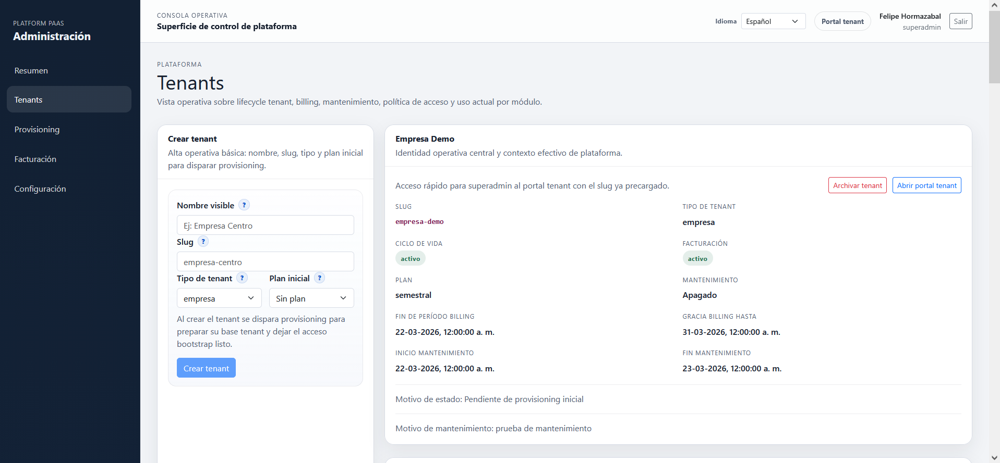
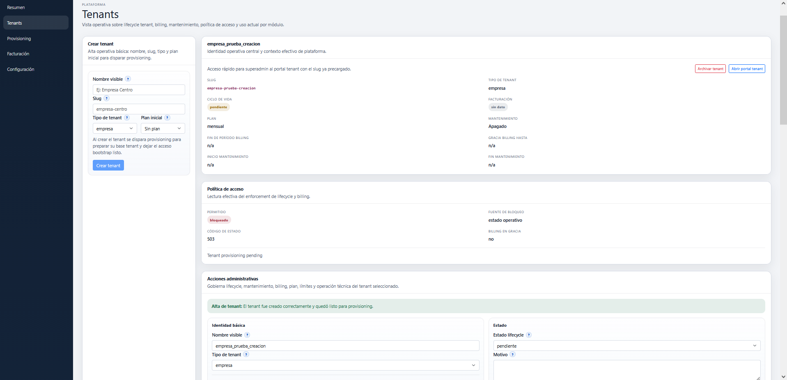
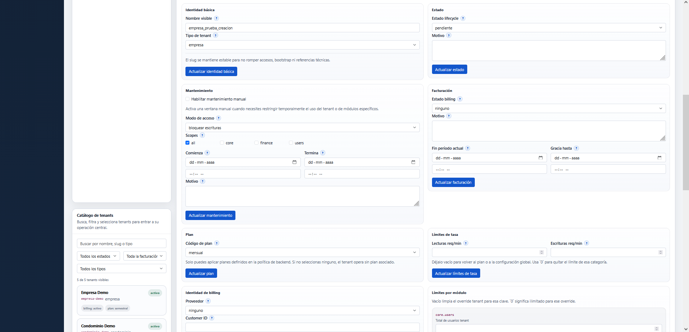
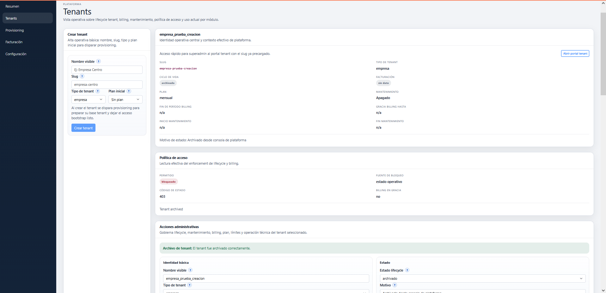

# Ciclo Basico de Tenants

Este runbook resume el bloque minimo que hoy ya puede resolverse desde `platform_admin` sin salir a scripts ni a llamadas manuales de API.

Sirve para ubicar rapidamente que parte del ciclo basico del tenant ya esta cerrada y que decision de producto sigue abierta.

## Alcance actual

Desde `Tenants` hoy ya puedes:

- crear tenant
- buscar tenants por nombre, slug o tipo
- filtrar tenants por estado, billing y tipo
- editar identidad basica del tenant
- archivar tenant como baja operativa segura
- eliminar tenant de forma definitiva solo en modo seguro y acotado
- abrir el portal tenant solo cuando el tenant ya esta realmente listo
- operar estado, mantenimiento, billing, plan, limites y sincronizacion de esquema

## 1. Crear tenant

La alta visual pide:

- nombre visible
- slug
- tipo de tenant
- plan inicial opcional

Al confirmar:

- el tenant se crea en `platform_control`
- nace en `pending`
- se dispara un job `create_tenant_database`

Lectura practica:

- crear tenant no significa que ya este listo para usar
- significa que entro al catalogo central y quedo listo para provisioning
- el detalle del tenant ya muestra un bloque `Provisioning` con el ultimo job visible para ese tenant
- desde ese bloque ya puede abrirse la pantalla global de `Provisioning` o ejecutar/reintentar el job segun su estado
- el acceso rapido a `tenant_portal` ya debe reservarse para tenants `active` con provisioning completado



## 2. Catalogo y filtros

El catalogo ya permite:

- buscar por nombre, slug o tipo
- filtrar por `status`
- filtrar por `billing_status`
- filtrar por `tenant_type`

Eso deja la vista usable para operacion diaria sin depender de una lista larga sin contexto.

Despues del alta, el tenant nuevo entra al catalogo con `status=pending` y queda listo para seguirse desde `Provisioning`.

Lectura practica importante:

- `crear tenant` = alta en catalogo central
- `provisionar tenant` = materializar DB tenant, rol tecnico, esquema y bootstrap
- esas dos cosas son parte del mismo ciclo, pero no son la misma accion



## 3. Editar identidad basica

La edicion basica actual permite cambiar:

- `name`
- `tenant_type`

No cambia:

- `slug`

Criterio actual:

- el `slug` se trata como identificador estable
- cambiarlo sin una politica formal puede romper portal tenant, bootstrap, credenciales esperadas y referencias operativas



## 4. Archivar tenant

`Archivar tenant` es hoy la baja operativa correcta.

No hace:

- borrado fisico
- eliminacion de DB tenant
- limpieza de billing history
- limpieza de policy history

Si hace:

- mover el tenant a `status=archived`
- dejarlo fuera de la operacion normal
- conservar trazabilidad y capacidad de auditoria



## 4b. Restaurar tenant archivado

La restauracion ya existe como flujo formal y no como mutacion improvisada del lifecycle.

La accion pide:

- estado destino
- motivo de restauracion

Estados destino permitidos:

- `pending`
- `active`
- `suspended`

Lectura practica:

- `pending`: reabre el tenant pero lo deja fuera de uso normal mientras se revisa o reprovisiona
- `active`: reabre el tenant para operacion normal
- `suspended`: lo saca de `archived`, pero lo deja aun restringido por decision operativa

La restauracion:

- no cambia `slug`
- no borra historial
- no elimina billing history ni policy history
- deja trazabilidad con evento propio de `restore`

## 5. Politica operativa vigente

Para no seguir mezclando recomendaciones con decisiones, la politica vigente del producto queda asi:

### `slug`

- el `slug` se trata como identificador estable
- no se expone su edicion en UI
- cualquier cambio futuro de `slug` requeriria una politica formal de migracion y compatibilidad

Motivo:

- el `slug` participa en rutas, credenciales bootstrap, referencias operativas, acceso al portal tenant y lectura humana del catalogo

### `archive`

- `archive` es la baja operativa correcta en esta etapa
- un tenant archivado sale de la operacion normal sin perder historia ni trazabilidad
- la consola debe seguir priorizando esta salida por sobre cualquier borrado duro

### `delete`

- ya existe un borrado seguro y muy acotado
- solo aplica a tenants `archived`
- exige que no exista configuracion DB tenant materializada
- bloquea tenants con historial de billing
- bloquea tenants con provisioning completado
- esta pensado para altas descartadas, tenants de prueba o casos que no deben conservarse

### restauracion

- ya existe una accion formal de `restore` para tenants archivados
- la restauracion pide:
  - estado destino (`pending`, `active` o `suspended`)
  - motivo de restauracion
- no cambia `slug`
- no elimina historial
- no equivale a editar el lifecycle archivado de forma improvisada
- el acceso rapido al portal tenant no debe presentarse como accion util para tenants `pending`, `archived` o con provisioning incompleto

## 6. Que no conviene hacer todavia

No conviene abrir un `delete` duro para tenants provisionados o con historia real.

Motivo:

- un tenant no es solo una fila
- puede arrastrar DB tenant
- jobs de provisioning
- billing history
- policy history
- contexto de auditoria

Por eso el borrado actual sigue siendo deliberadamente estrecho y `archive` se mantiene como salida principal.

## 7. Estado actual del bloque basico

Este bloque ya queda practicamente cerrado a nivel de consola:

- alta
- catalogo
- filtros
- identidad basica
- archivo operativo
- delete seguro y acotado
- operacion diaria

Lo que sigue abierto aqui ya no es una falta de UI base, sino una decision de producto:

- definir recien despues, y solo si se vuelve necesario, una politica de baja dura para tenants provisionados o con historia real

## 8. Validacion recomendada

Cuando cambies este bloque, la validacion corta recomendada es:

1. crear tenant
2. confirmar que aparece en catalogo
3. confirmar que se genero provisioning
4. editar `name` o `tenant_type`
5. archivar tenant
6. confirmar que sale de la operacion normal con `status=archived`
7. probar `delete` solo si el tenant sigue archivado y nunca llego a quedar materializado
8. restaurar tenant con un estado destino explicito cuando corresponda
9. revisar politica de acceso y efecto operativo

## 8b. Validacion funcional corta en UI

Si quieres validar rapidamente el flujo nuevo sin abrir una prueba larga, usa esta secuencia:

### Caso sugerido

1. entrar a `Tenants`
2. crear un tenant nuevo con:
   - nombre visible
   - slug claro
   - tipo de tenant
   - plan opcional
3. confirmar que aparece en el catalogo y nace en `pending`
4. editar `name` o `tenant_type`
5. confirmar que el `slug` no cambia
6. archivar tenant
7. confirmar que:
   - el tenant queda en `archived`
   - la politica de acceso deja de permitir operacion normal
8. usar el bloque `Restauracion`
9. elegir un estado destino explicito:
   - `pending`
   - `active`
   - o `suspended`
10. confirmar que:
   - el tenant sale de `archived`
   - el nuevo estado queda visible en catalogo y detalle
   - el motivo de restauracion queda trazable

### Resultado esperado

El flujo se considera sano si:

- el alta no requiere salir de `Tenants`
- la identidad basica cambia sin tocar el `slug`
- `archive` funciona como baja operativa
- `restore` no reaparece como cambio informal de lifecycle
- el tenant vuelve con el estado destino elegido

### Cuando repetir esta validacion

Conviene repetir esta secuencia si cambias:

- formularios de `Tenants`
- reglas de lifecycle
- labels de estados
- politica de acceso derivada del lifecycle
- feedback de acciones administrativas

## 9. Cobertura automatizada actual

Este bloque ya no depende solo de prueba manual.

Hoy la suite `platform` ya cubre al menos:

- alta de tenant
- edicion basica
- validacion de campos obligatorios
- cambio de estado
- restauracion de tenant archivado
- rechazo de restore sobre tenants no archivados

Suite recomendada:

```bash
cd /home/felipe/platform_paas/backend
/home/felipe/platform_paas/platform_paas_venv/bin/python -m unittest app.tests.test_platform_flow
```

## 10. Documentacion relacionada

- [Guia unica para entender la app](../architecture/app-understanding-guide.md)
- [Roadmap de frontend](../architecture/frontend-roadmap.md)
- [Roadmap de desarrollo](../architecture/development-roadmap.md)
- [Prueba guiada de provisioning](./provisioning-guided-test.md)
