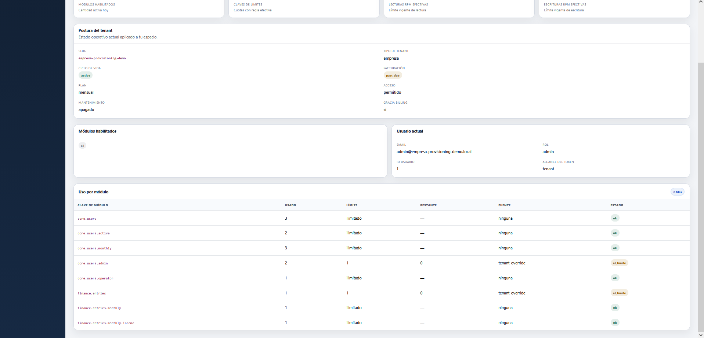
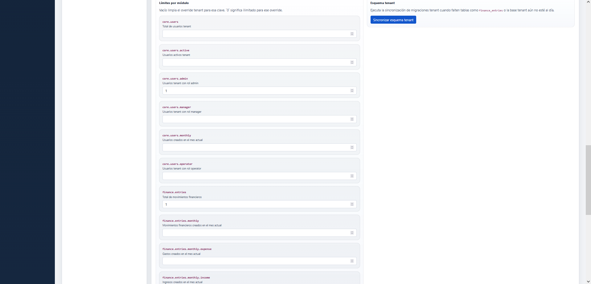
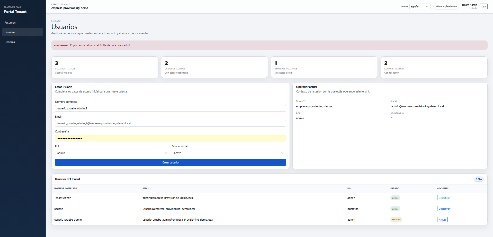

# Prueba Guiada de Tenant Portal

Este runbook documenta la prueba real usada para validar el uso normal del `tenant_portal` sobre un tenant ya provisionado.

La idea es simple:

- entrar al portal tenant con la cuenta bootstrap
- revisar el `Resumen`
- crear un usuario
- crear un movimiento financiero
- confirmar que cambian los KPIs y el uso por modulo

## Objetivo

Entender en la practica que el tenant ya no solo existe y esta provisionado, sino que tambien puede operar su espacio.

## Precondiciones

- backend levantado
- frontend levantado
- tenant ya provisionado
- credencial bootstrap disponible

Caso usado:

- tenant: `empresa-provisioning-demo`
- usuario: `admin@empresa-provisioning-demo.local`
- password: `TenantAdmin123!`

## Paso 1. Entrar al `tenant_portal`

Se entra al portal con:

- `Código de tu espacio = empresa-provisioning-demo`
- `Usuario = admin@empresa-provisioning-demo.local`
- `Contraseña = TenantAdmin123!`

Pantalla base:

## Paso 2. Revisar el `Resumen`

Primera lectura general:

Vista con billing visible:

Uso por modulo despues de operar:

Uso por modulo con multiples cuotas ya tensionadas:

Qué se valida aqui:

- el tenant entra correctamente al portal
- el `billing_status` actual se refleja en la postura
- el usuario actual y el scope del token son coherentes
- el uso por modulo cambia cuando se crean usuarios o movimientos

## Paso 3. Crear un usuario

Pantalla base de usuarios:

Vista con el alta realizada:

Qué se valida:

- el alta responde con mensaje de exito
- los KPIs suben
- la tabla refleja el nuevo usuario
- el modulo `core.users` aumenta su uso

## Paso 4. Crear un movimiento financiero

Pantalla base de finanzas:

Vista con movimiento ya creado:

Qué se valida:

- el alta responde con mensaje de exito
- suben `Movimientos`, `Ingresos` o `Egresos`
- el balance cambia
- `Uso efectivo` del modulo `finance.entries` aumenta

## Paso 5. Probar enforcement de limite por modulo

Primero se revisa el estado normal del modulo financiero:

En esta lectura:

- `Movimientos usados = 1`
- `Límite = 250`
- `Restante = 249`
- `Estado = ok`

Luego, desde `Tenants`, se aplica un override central a:

- `finance.entries = 1`

Captura del ajuste central:

Despues de eso, al volver al `tenant_portal`, la misma pantalla queda asi:

Qué se valida:

- el `tenant_portal` refleja el cambio central sin ambiguedad
- `Movimientos usados = 1`
- `Límite = 1`
- `Restante = 0`
- `Fuente = tenant_override`
- `Estado = al_límite`

## Paso 6. Intentar operar estando al limite

Con el modulo ya en `al-límite`, se intento crear otro movimiento desde `tenant_portal > Finanzas`.

Resultado real:

Qué se valida:

- el backend no deja crear el movimiento extra
- el frontend muestra mensaje claro
- el texto visible fue:
  - `El plan actual alcanzó el límite de finance.entries`

Esto confirma que el enforcement no solo se ve en los indicadores:

- tambien bloquea la operacion real cuando se intenta exceder la cuota

## Paso 7. Probar enforcement del limite de admins

Desde `Tenants`, tambien se aplico un override central sobre:

- `core.users.admin = 1`

Captura del ajuste central:

Despues, en `tenant_portal > Usuarios`, se intento crear otro usuario con rol `admin`.

Resultado real:

Qué se valida:

- el limite de admins ya se refleja en el portal tenant
- el backend no deja crear un admin adicional cuando no queda cupo
- el frontend muestra un mensaje claro
- el mensaje esperado para usuario ya no depende del codigo tecnico:
  - `No puedes crear otro administrador porque tu plan ya alcanzó el límite de administradores.`

Caso de borde corregido despues de esta prueba:

- si ya existe un admin activo y el tenant esta en el limite `core.users.admin`
- tampoco debe poder reactivarse otro usuario `admin` que estuviera inactivo
- ese hueco quedo cerrado en backend para que el cupo no pueda saltarse por cambio de estado
- y en ese caso la UI debe mostrar un texto equivalente a:
  - `No puedes habilitar otro administrador porque tu plan ya alcanzó el límite de administradores.`

## Qué aprendimos de esta prueba

- `Provisioning` deja al tenant listo
- `Billing` gobierna su estado comercial
- `tenant_portal` demuestra que el tenant puede operar realmente
- `Usuarios` y `Finanzas` impactan el uso por modulo en tiempo real
- los overrides hechos en `Tenants` se reflejan en el `tenant_portal`
- el enforcement por modulo ya es visible para el operador tenant
- cuando el modulo llega al limite, el backend bloquea la accion y el frontend lo comunica con un mensaje entendible
- ese enforcement ya fue validado tanto para `finance.entries` como para `core.users.admin`

## Relación con las otras pruebas guiadas

- [Prueba guiada de provisioning](./provisioning-guided-test.md)
- [Prueba guiada de billing](./billing-guided-test.md)
